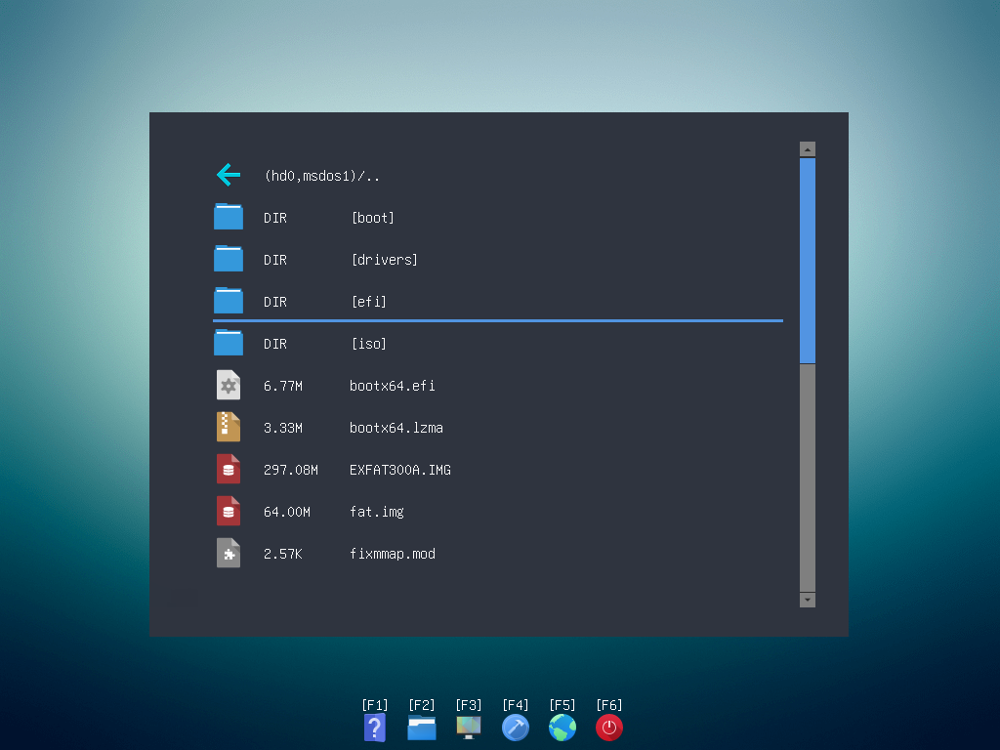

# GRUB2 File Manager 
    

## 预览



## 功能 

| 类型                                       | i386-pc | i386-efi | x86_64-efi |
| :----------------------------------------- | :-----: | :------: | :--------: |
| WinPE ISO               |    ✔️    |    ✔️     |     ✔️      |
| Linux ISO             |    ✔️    |    ✔️     |     ✔️      |
| Android ISO         |    ✔️    |    ✔️     |     ✔️      |
| BSD ISO                 |    ✔️    |    ❌     |     ❌      |
| IMG 磁盘镜像            |    ✔️    |    ✔️     |     ✔️      |
| VHD 硬盘镜像            |    ✔️    |    ✔️     |     ✔️      |
| WinPE WIM               |    ✔️    |    ✔️     |     ✔️      |
| NT5 WinPE               |    ✔️    |    ❌     |     ❌      |
| Linux/Multiboot 内核 |    ✔️    |    ✔️     |     ✔️      |
| EFI 应用程序            |    ❌    |    ✔️     |     ✔️      |

## 下载

[GitHub](https://github.com/a1ive/grub2-filemanager/releases) [Gitee](https://gitee.com/a1ive/grub2-filemanager/releases)

## 构建 
### Linux 
```shell
git clone https://github.com/a1ive/grub2-filemanager.git
cd grub2-filemanager
./update_grub2.sh
echo "1" | ./build.sh
```

## 启动 
**不要使用 memdisk 加载 grubfm.iso !**  

### GRUB4DOS 
```
map --mem /grubfm.iso (0xff)
map --hook
chainloader (0xff)
```
### GRUB 2
```
if [ "${grub_platform}" = "pc" ]; then
  linux /loadfm  
  initrd /grubfm.iso  
else
  chainloader /grubfm.efi
fi
```
### rEFInd

```
loader /grubfm.efi
```
## 安装工具

- [GrubFM Installer](https://github.com/QuestYouCraft/grubfm-installer)
- [Multiboot-Toolkit](https://github.com/niemtin007/Multiboot-Toolkit)
- [MultiBoot Utility](https://github.com/MultiBoot-Utility/MultiBoot-Utility)
- [UEFI_MULTI](https://github.com/wimbrts/UEFI_MULTI)

## 支持的发行版列表

- [链接](distro.md)

## 支持的语言

简体中文 繁体中文 英语 法语 德语 西班牙语 希伯来语 波兰语 俄语 土耳其语 乌克兰语 越南语

[帮助翻译此项目](https://crowdin.com/project/grub2-filemanager)

## 源码

*	[GRUB2 File Manager](https://github.com/a1ive/grub2-filemanager)  
*	[GRUB2](https://github.com/a1ive/grub) 

## 相似项目

*	[Multiboot USB](http://mbusb.aguslr.com/) 
*	[Easy2Boot](https://www.easy2boot.com/)
*	[grub-iso-boot](https://github.com/Jimmy-Z/grub-iso-boot) 
*	[grub-iso-multiboot](https://github.com/mpolitzer/grub-iso-multiboot) 
*	[GLIM](https://github.com/thias/glim) 
*	[GRUB2 File Explorer](http://bbs.wuyou.net/forum.php?mod=viewthread&tid=320715) 
*	[RUN](http://bbs.wuyou.net/forum.php?mod=viewthread&tid=191301) 
*	[G4D AUTOMENU](http://bbs.wuyou.net/forum.php?mod=viewthread&tid=203607) 
*	[Ventoy](https://github.com/ventoy/Ventoy)

## 捐赠

项目的发展离不开您的支持！

[Gitee](https://gitee.com/a1ive/grub2-filemanager) 请点击网页最下方的 "捐赠" 按钮，支持微信/支付宝

[GitHub](https://github.com/a1ive/grub2-filemanager) 请点击网页上的 "Sponsor" 按钮，支持支付宝/PayPal